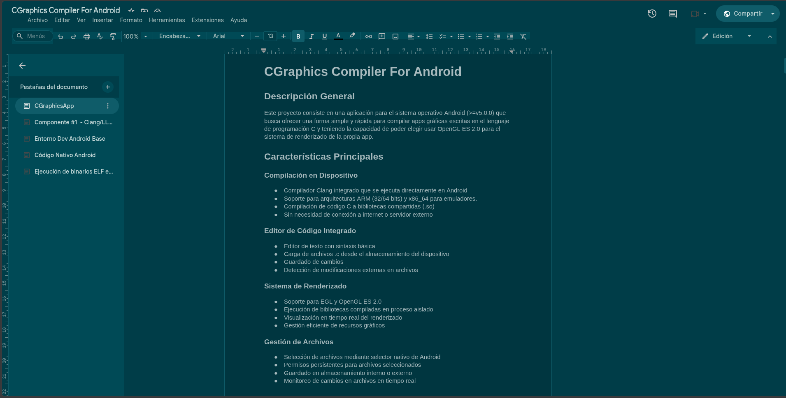

# Selenized Docs

Tema oscuro para Google Docs con paletas de luminosidad perceptual uniforme,
pensado para reducir el ruido visual y la fatiga en sesiones largas.



## Por qué

Los temas oscuros al uso invierten colores y ya. El problema real de una
interfaz no es que sea clara, es que **compite por tu atención**: colores que
saltan más que otros, anuncios, iconos a todo color, animaciones.

Este tema ataca las dos cosas:

- **Paletas calibradas.** Selenized Dark tiene los 16 colores ajustados para
  que todos tengan la misma luminosidad percibida. Se distinguen por tono,
  pero ninguno reclama atención por encima del resto.
- **Menos elementos.** Se ocultan los promos de la barra (Google One, Gemini),
  el logo, el avatar y el panel de complementos. Nada de eso aporta al
  documento que estás escribiendo.

## Instalación

No está en la Chrome Web Store. Se carga sin empaquetar:

1. Abre `chrome://extensions` (o `brave://extensions`).
2. Activa **Modo de desarrollador**.
3. **Cargar descomprimida** y selecciona esta carpeta.

## Paletas

Se eligen desde el popup y se aplican en caliente, sin recargar.

| Paleta | Origen |
|---|---|
| **Selenized Dark** (por defecto) | [jan-warchol/selenized](https://github.com/jan-warchol/selenized) |
| **Everforest Soft** | [sainnhe/everforest](https://github.com/sainnhe/everforest) |
| **Rosé Pine Moon** | [rose-pine](https://rosepinetheme.com) |

Son las mismas que uso en kitty, así que terminal y documento van a juego.

## Cómo funciona

Google Docs ya no dibuja el texto en HTML: lo **rasteriza en un `<canvas>`**.
Dentro de un canvas no hay nodos que colorear, así que ningún CSS puede
cambiar el color del texto de tu documento. Eso parte el problema en dos
mitades con soluciones distintas.

### La interfaz

Docs moderno pinta con tokens `--gm3-sys-color-*`. Redefinirlos cubre gran
parte del trabajo de una vez, más limpio que perseguir cien selectores. El
resto son reglas puntuales para lo que se resiste (Docs pinta algunas
etiquetas con sus colores de marca, por encima de los tokens).

Los sprites de iconos son PNG oscuros que desaparecerían sobre fondo oscuro,
así que se invierten — excluyendo los logos de producto, que sí son a color.

### La hoja

Se invierte el lienzo entero:

```css
canvas.kix-canvas-tile-content {
  filter: invert(1) hue-rotate(180deg) brightness(var(--sd-ink));
  mix-blend-mode: screen;
}
```

- `invert(1)` — el papel blanco pasa a negro, el texto negro pasa a blanco.
- `hue-rotate(180deg)` — devuelve su tono real a fotos y texto de color.
- `mix-blend-mode: screen` — deja pasar el fondo de la hoja donde el lienzo
  quedó negro, tiñendo el papel con el color de la paleta en vez de un negro
  plano.
- `brightness()` — sin esto el texto sale **blanco puro**. Con `screen` sobre
  un fondo opaco el resultado es `255 − (1−b)·(255 − fondo)`, así que se
  despeja `b` para que el blanco caiga justo en el gris de texto de cada
  paleta. De ahí sale `--sd-ink`: 0.66, 0.69 y 0.89 respectivamente.

## Limitaciones

Son de la técnica, no del código, y las comparte cualquier tema oscuro para
Docs:

- **Las imágenes de tu documento se invierten**, porque están pintadas en el
  mismo canvas. El `hue-rotate` las deja aceptables, no perfectas.
- **`mix-blend-mode` puede variar según la GPU.** El popup trae «negro plano»
  como alternativa si la hoja se ve rara.
- **Everforest y Rosé Pine no clavan el tono del texto**, solo la
  luminosidad. Sus grises son cálidos y `screen` sobre un fondo frío solo
  puede sumar luz, no restar azul.

## Permisos

Solo `storage`, para recordar la paleta elegida. Sin service worker, sin
peticiones de red, y el content script corre únicamente en
`docs.google.com/document/*`.

## Volver atrás

Cada bloque que oculta algo está comentado como tal en `css/theme.css`. Para
recuperar los promos, el logo, el avatar o el panel de complementos, comenta
el bloque correspondiente. El interruptor del popup desactiva todo de golpe.

## Créditos

La técnica de invertir el canvas está tomada de
[DocsAfterDark](https://github.com/waymondrang/docsafterdark), de Raymond
Wang. El CSS de este repo es propio.

MIT.
